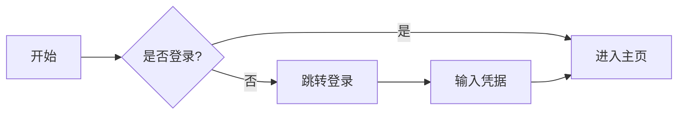
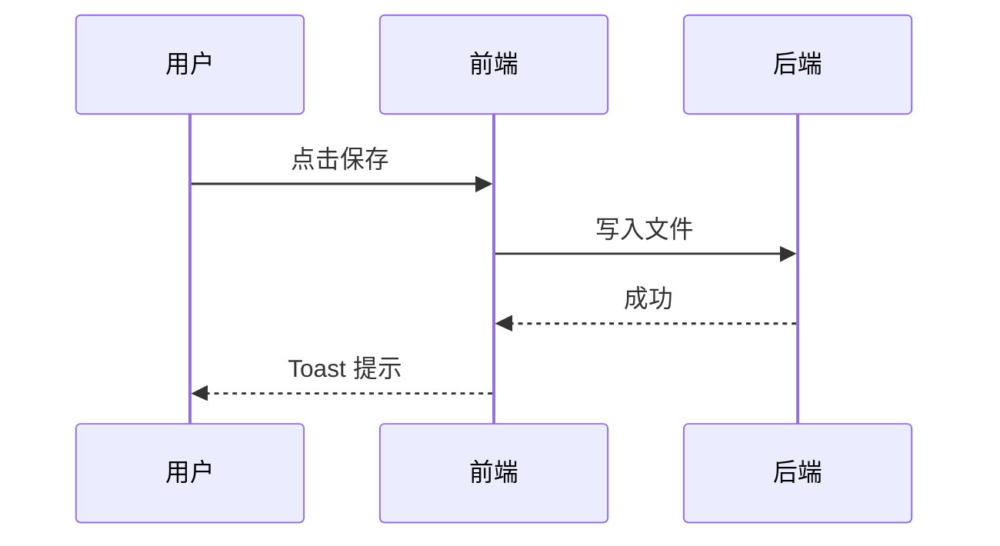
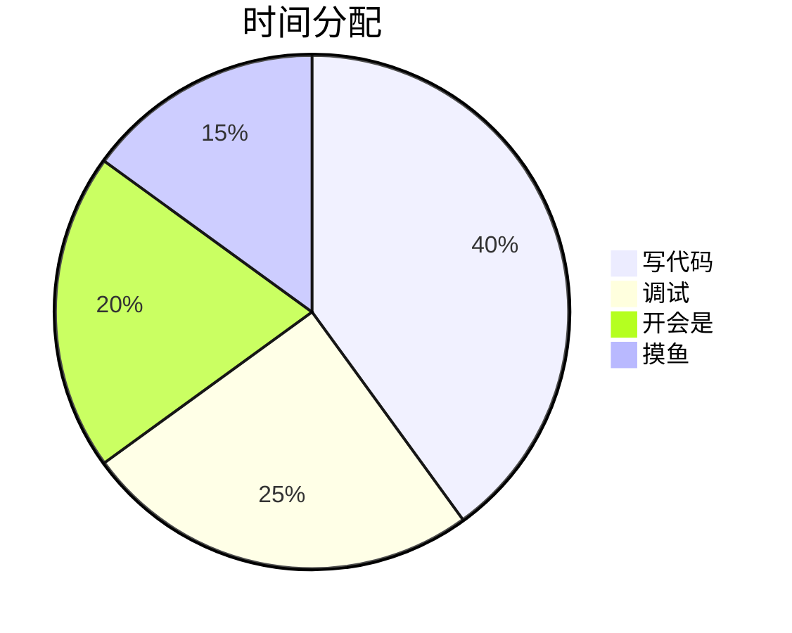

# 好记 v2.0 👋

一个轻量、快速、**实时渲染**的 Markdown 编辑器。

> 💡 这页本身就是功能演示。**光标移开每一行**，看它如何从源码变渲染。

## 🗂️ 多标签页（v2.0 新增）

顶部标签栏可以**同时打开多个文档**：

- 点右上角 **`+`** 新建标签
- 点标签标题切换文档，**每个标签独立保留**光标、撤销栈、滚动位置
- 点标签上的 **`×`** 或**中键**关闭
- 拖入多个 .md 文件，每个开一个标签
- 同一文件不会重复打开（自动切到已开的标签）
- **Ctrl + S** 保存当前标签，**Ctrl + Alt + S** 保存全部
- 关闭窗口时若有未保存文档，会列出清单让你确认

## 🎛️ 设置面板（v2.0 新增）

点顶栏右侧 **⚙ 齿轮**打开设置，分四类：

- **基础**：主题 / 字号 / 字体族 / 最近文件数
- **编辑**：自动保存 / 拼写检查 / 行号 / 软换行
- **渲染**：Mermaid 主题 / 代码高亮 / 公式开关 / 图片开关
- **应用**：更新频率 / 更新通道 / 数据位置

设置自动持久化到 `%APPDATA%\好记\settings.json`，重启保留。

## 实时渲染（Obsidian 风）

光标所在行显示源码，其余行自动渲染。v2.0 基于**语法树**解析，更准更稳：

- **加粗**、*斜体*、***粗斜体***、~~删除线~~、`行内代码`
- [链接](https://example.com) 自动识别
- 标题里的 **加粗** 和 *斜体* 也能渲染（v1 做不到）
- > 引用块带左侧竖线

### 任务列表

- [x] 已完成的事项
- [ ] 待办事项
  - 嵌套子项也支持
- 普通列表项

### 引用式图片与链接

![好记图标][logo]

更多详见 [官网][site]。

[logo]: data:image/svg+xml;utf8,<svg xmlns="http://www.w3.org/2000/svg" width="80" height="80"><circle cx="40" cy="40" r="36" fill="%23f59e0b"/><text x="40" y="52" text-anchor="middle" fill="white" font-size="36" font-weight="bold">好</text></svg>
[site]: https://example.com

## 三个视图

顶栏切换 **实时 / 源码 / 预览**：

- **实时**：边写边渲染（默认，对标 Obsidian）
- **源码**：纯 Markdown 文本 + 行号
- **预览**：完整渲染（代码高亮、公式、Mermaid 图）

## 快捷键

| 操作 | 快捷键 |
|---|---|
| 加粗 | Ctrl + B |
| 斜体 | Ctrl + I |
| 行内代码 | Ctrl + E |
| 保存当前标签 | Ctrl + S |
| 保存全部标签 | Ctrl + Alt + S |

## 代码块与图表

支持围栏代码块（带语法高亮）、表格、数学公式、Mermaid 流程图。切到「预览」视图可看完整渲染。

```ts
// 代码块内的 $ 和 * 不会被误解析（v1 的 bug 已修）
function greet(name: string): string {
  return `Hello, ${name}!`  // 模板字符串里的 $ 安全
}
```

行内代码 `$x$` 和 `*foo*` 保持原样，不被当成公式或斜体。

数学公式：行内 $E = mc^2$，块级：

$$
\int_{-\infty}^{\infty} e^{-x^2} dx = \sqrt{\pi}
$$

### Mermaid 图表（切到「预览」视图查看渲染效果）

流程图：



时序图：



饼图：



> 💡 在实时视图里，**点击**渲染后的代码块 / 表格 / 公式，即可进入编辑。Mermaid 图在「预览」模式下完整渲染。

## 还能做

- 🌙 暗色模式（亮 / 暗 / 跟随系统，可在设置里固定）
- 📑 左侧大纲自动生成，点击跳转，**代码块里的 `# 注释` 不会误判为标题**
- 🔤 顶栏 A+/A− 调字号（也可在设置里调）
- 📥 拖拽 .md 文件到窗口直接打开，**支持多文件**
- 💾 保存时**原子写入**（断电也不会损坏文件）
- 🔤 打开 GBK / UTF-16 编码的 .md 自动识别不乱码
- 🔄 关闭重开自动恢复上次的标签列表（含未保存内容）

---

**开始写点什么吧。** 这页内容选中删除即可，或点 `+` 新开一个标签。
